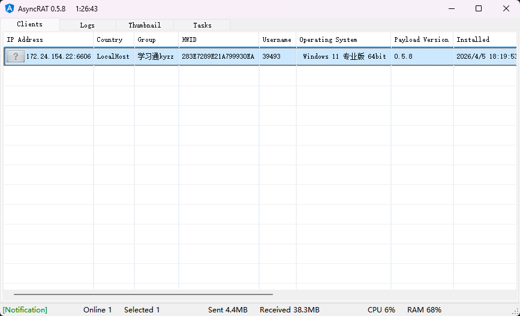
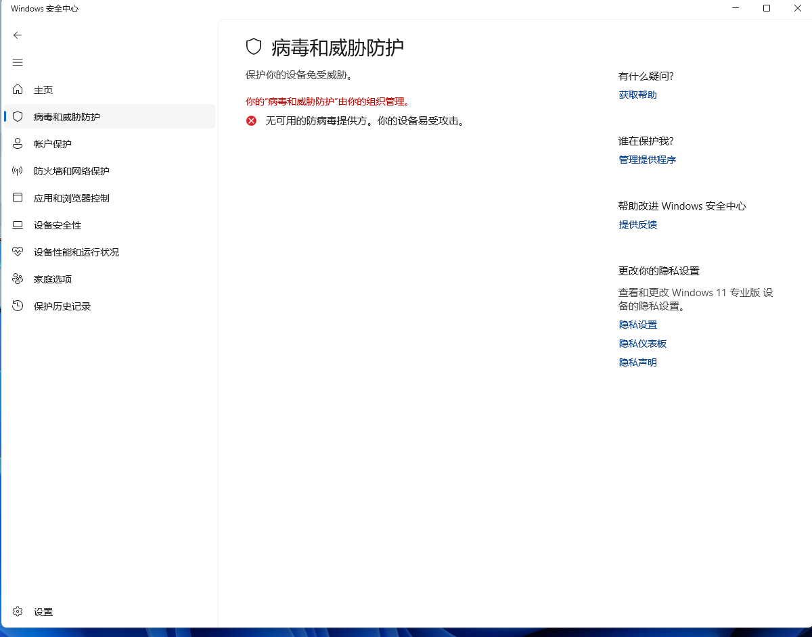
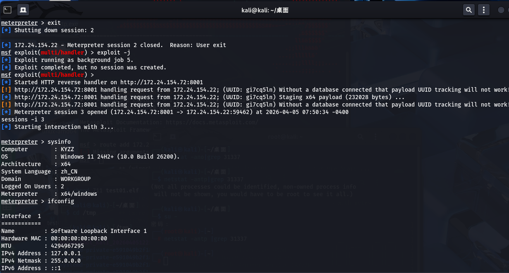
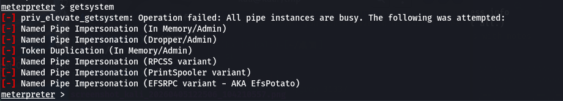
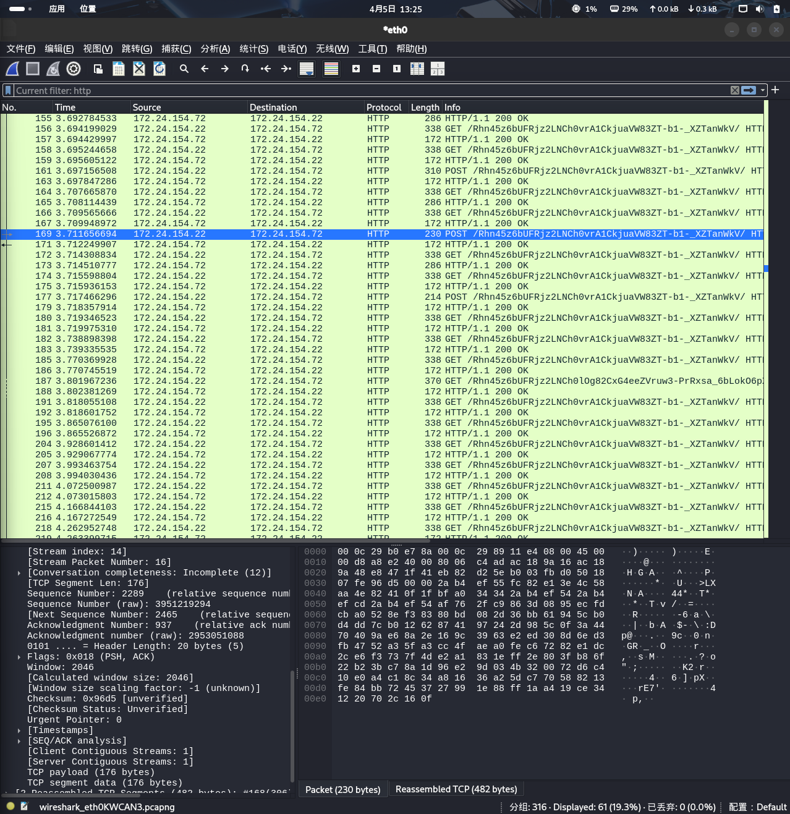

# 📝 Test01: 多维联动下的防御弱化与后渗透深度接入研究

**实验编号**：LAB-2026-0405  
**实验重点**：C2 架构协同、Registry Modification (注册表篡改)、防御规避机制分析。

## 1. 实验综述 (Abstract)

本实验模拟了一个典型的红队攻击链路：在目标主机（Windows 11）开启基础防护的情况下，通过轻量级远控工具 AsyncRAT 获取初始控制权，并利用其高权限模块执行 Registry Modification 以致盲 Windows Defender。随后，利用安全真空期植入功能更完备的 Metasploit (MSF) 载荷，验证了“多级投递、分段控制”在现代防御体系下的有效性。

## 2. 实验环境拓扑 (Lab Topology)
**网络环境**: 局域网隔离环境 (Isolated LAN)，模拟边界突破后的内网渗透场景。

 

- **攻击机 (Attacker)**: Kali Linux (IP: 192.168.x.a) —— 部署 MSF Handler 与 AsyncRAT Server。
- **目标机 (Target)**: Windows 11 Pro (IP: 192.168.x.b) —— 受控实验终端。
- **网络环境**: 局域网隔离环境 (Isolated LAN)，模拟边界突破后的内网渗透场景。

## 3. 攻击链路拆解 (Attack Chain Analysis)

### 阶段一：AsyncRAT 初始接入与权限获取

1. **载荷部署**：生成 AsyncRAT 客户端载荷并投递至目标机。
2. **静态逃逸策略**：当前实验采用手动关闭实时防护以验证链路，后续实验计划引入 **代码混淆 (Obfuscation)** 提升 Bypass 成功率。
3. **Session 建立**：成功获取目标机交互式管理权限，包括文件管理、桌面监控及进程管理。

### 阶段二：基于注册表篡改的防御弱化 (Defense Evasion)
**实验观察**: 修改后，Windows Defender 状态显示为“由组织管理”，系统失去对新生成恶意载荷的阻断能力。

1. **核心操作**：调用 AsyncRAT 内置提权模块，执行 Registry Modification。
2. **底层原理**：通过向 `HKEY_LOCAL_MACHINE\SOFTWARE\Policies\Microsoft\Windows Defender` 路径注入 `DisableAntiSpyware = 1` 键值，强制关闭系统实时监控。
3. **实验观察**：修改后，Windows Defender 状态显示为“由组织管理”，系统失去对新生成恶意载荷的阻断能力。

### 阶段三：Metasploit 深度控场与持久化
**多级控制**: 建立 Meterpreter Session。利用 MSF 强大的后渗透插件进行权限维持。

1. **载荷植入**：投递 `windows/x64/meterpreter/reverse_http` 载荷。由于 Defender 已瘫痪，MSF 载荷成功绕过静态扫描。
2. **多级控制**：建立 Meterpreter Session。利用 MSF 强大的后渗透插件进行权限维持。
3. **横向移动准备**：开启 autoroute，为后续局域网内其他存活主机的探测建立逻辑跳板。

## 4. 技术痛点与故障排查 (Troubleshooting)
* **Issue**: 执行 `getsystem` 命令时报错 `All pipe instances are busy`。

- **Issue**：执行 `getsystem` 命令时报错 `All pipe instances are busy`。
- **Analysis**：在 Windows 11 中，即使拥有 Admin 权限，受 UAC (User Account Control) 限制，进程仍运行在“中等完整性级别”。命名管道冒充技术受到严格访问控制限制。
- **Solution**：记录该失败案例，计划在后续实验中引入基于 Fodhelper 或 DiskCleanup 的 UAC Bypass 技术进行提权。

## 5. 考研知识点复盘 (Academic Linkage)
**计算机网络 (Networking)**：通过 Wireshark 观察 `reverse_http` 载荷周期性回连的心跳包特征。

- **操作系统 (OS)**：分析了 Windows 完整性级别 (Integrity Level) 与 访问控制列表 (ACL) 的博弈。
- **计算机网络 (Networking)**：通过 Wireshark 观察 reverse_http 载荷周期性回连的心跳包特征，理解应用层协议的隐蔽封装。
- **程序分析**：探讨了注册表作为操作系统全局配置中心，在安全策略加载中的关键地位。

## 6. 文件夹资源说明 (Resources)

- **/screenshots**：包含 AsyncRAT 控制面板、Defender 策略篡改截图及 MSF Session 界面。
- **/scripts**：包含模拟 Registry Mod 的 PowerShell 脚本及 MSF 自动化监听配置脚本。

---

⚠️ **免责声明**  
本项目仅用于合法学术研究。严禁在未经授权的设备上尝试上述操作。

---